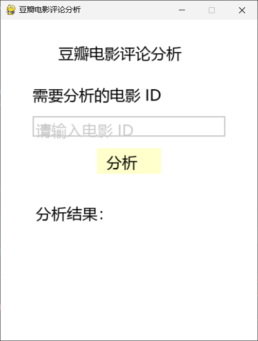
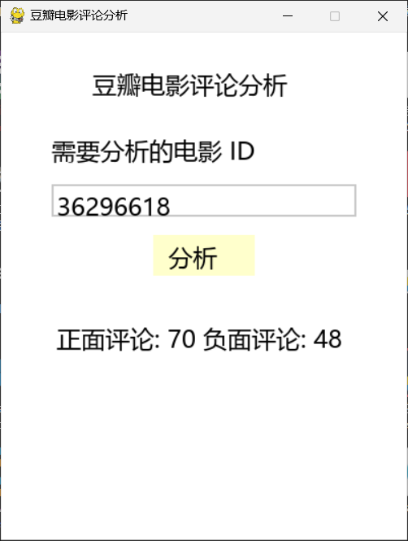
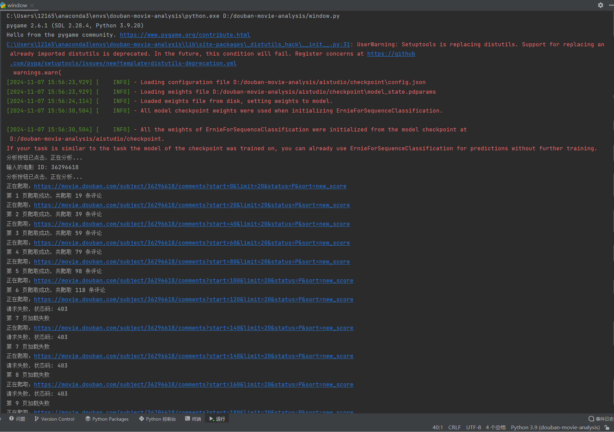

### 项目简介

项目全程使用`python`环境，版本`python-3.9.20`，开发IDE工具`PyCharm`，版本`PyCharm Community Edition 2021.3.2`，程序相对来说比较粗制滥造了

窗体使用`pygame`库开发

主要功能就是爬取豆瓣电影的指定详细页的评论，然后用爬到的评论使用训练好的情感分析模型进行输出分析正面评论和负面评论的数量

目录：`D:\douban-movie-analysis\aistudio\checkpoint`里面是已经训练好了的一个情感分析模型

`analyze_comments.py`是pygame窗口需要调用的模块：我把爬虫和调用本地情感分析模型的功能都集成进去了

`window.py`是pygame的窗口代码：主要就是运行窗口控件调用`analyze_comments.py`里面的`analyze_movie`模块

`spider.py`是原来用来测试的爬虫的代码

目前大致修改好了爬虫，现在`analyze_comments.py`的爬虫爬到第6页评论时会触发请求失败，状态码: 403，后面再看下有没有解决办法

目前爬虫的每页请求之间的延时范围设定为 5-20 秒，所以爬也得等一下

<br>

### 注意事项

1. **依赖库**: 确保安装了所有需要的库和anaconda，包括`paddle`, `paddlenlp`, `pygame`, `pyperclip`，`emoji` ，`fake_useragent`和 `beautifulsoup4`。其他需要的库基本不需要安装,除非你用的不是conda环境
   
2. **字体路径**: 检查字体路径是否正确。我用的msyh.ttc(微软雅黑)
   
3. **模型路径**: 确保模型的路径正确且模型已下载并准备好。模型已经训练好了,需在[发行版](https://github.com/4KAForever11/douban-movie-analysis/releases)下载所有源码里面包含了模型
   
4. **运行环境**: 确保在适合的 Python 环境中运行,我使用的conda创建了一个python版本为3.9的虚拟环境

<br>

### 安装部署

在[发行版](https://github.com/4KAForever11/douban-movie-analysis/releases)下载源代码

**1. 创建 Conda 虚拟环境**

在 **conda命令提示符** 中创建名为 `douban-movie-analysis` 的 conda 虚拟环境，指定 Python 版本为 3.9：

```bash
conda create -n douban-movie-analysis python=3.9
```
<br>
2. 激活 Conda 虚拟环境

```bash
conda activate douban-movie-analysis
```
<br>
3. 运行以下命令下载所需的库：

```bash
pip install -r requirements.txt
```
<br>
4. 下载完成后，运行`window.py`



在输入框里面粘贴好豆瓣电影的某个电影的ID，比如一个电影的详细页网址是：https://movie.douban.com/subject/36296618/
那么`36296618`就是这个电影的ID

最后点分析按钮运行程序，如果爬虫能正常爬取到数据，那么他就会继续运行，本地情感分析可能需要一点时间出结果，耐心等待下即可。

下面就是运行出来分析ID为`36296618`的电影`志愿军：存亡之战`的分析结果,不过由于爬虫能力的限制只爬到了6页评论，所以也就只分析了6页的评论😀



下面是python在运行的过程截图



### 程序运行的流程

**1. pygame的窗体**

**2. 加载本地情感分析模型**

**3. 等待用户输入网址**

**4. 等待用户点击分析按钮**

**5. 传入用户输入的网址**

**6. 运行爬虫爬取评论**

**7. 保存爬取到的评论**

**8. 调用情感分析模型进行分析**

**9. 返回结果给pygame窗体并显示**

### 更新日志

**v0.1-douban-movie-analysis**

`analyze_comments.py`

1. 随机 User-Agent 轮换：新版代码定义了`USER_AGENTS`列表，并在每次请求时随机选择一个`User-Agent`，提升了反爬虫抵抗能力。beta版代码则使用了固定的`User-Agent`，更容易被网站识别为爬虫。

2. 增加 Referer 头：新版代码在`fetch_comments_page`函数中添加了 `'Referer': 'https://movie.douban.com/'` 头信息，让请求更接近正常用户行为，有助于规避反爬虫机制。
 
3. 页面抓取逻辑的封装：新版代码将页面获取逻辑封装为 `fetch_comments_page` 函数，简化了主函数`get_movie_comments`的结构，使代码更清晰、更易维护。

4. 延时优化：新版代码在每页请求之间的延时范围设定为 5-20 秒，进一步避免频繁请求。旧版代码的延时范围相对较短（1-3 秒），可能增加被识别为爬虫的风险。

5. URL 模板的直接构建：新版代码直接在`get_movie_comments`中生成分页 URL，不再像旧版那样先定义模板然后替换，使代码更简洁清晰。

6. 分析调用接口调整：新版代码的`analyze_movie`函数直接接受电影`movie_id`作为参数，而不是完整的 URL，使用更加便捷。此外，新版还提供了输入电影 ID 的调用示例，方便使用者操作。

<br>

`window.py`

1.输入内容的简化:beta版用户需要输入完整的豆瓣电影 URL，例如 https://movie.douban.com/subject/36296618/
新版用户只需输入豆瓣电影的 电影 ID，例如 36296618。这种方式更加简洁、用户友好，避免了用户在输入时发生格式错误的可能。

2.输入框的提示文本更新:beta版输入框的提示文本为 "请输入电影 URL"，输入框内需填写完整的 URL。新版输入框的提示文本更新为 "请输入电影 ID"，简化了提示信息，也直接提示了用户所需输入的内容格式。

3.输入字符的长度限制:beta版最大输入字符长度为 40，适合 URL 的输入长度。新版最大输入字符长度减少至 10，更适合电影 ID 的长度，进一步优化了输入体验和数据验证。

4.ID格式验证的优化:beta版通过检查输入内容中是否包含 https://movie.douban.com/subject/ 来判断 URL 的有效性。新版直接检查输入内容是否为数字（movie_id.isdigit()），如果是数字即认为有效。这种检查方法更为直接，避免了不必要的 URL 校验。

5.`analyze_movie`函数调用参数的改变:beta版`analyze_movie` 接受的是完整的电影URL。新版`analyze_movie`接受的是电影 ID，使得后续的爬取和分析模块处理电影 ID 更加方便灵活。
