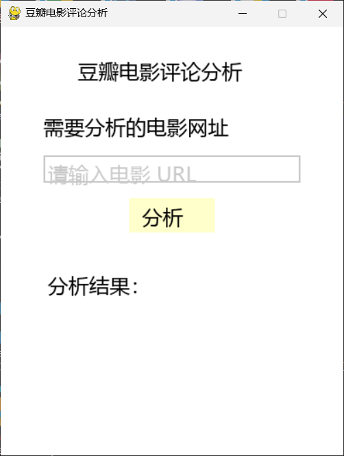

### 项目简介

项目全程使用`python`环境，版本`python-3.9.20`，开发IDE工具`PyCharm`，版本`PyCharm Community Edition 2021.3.2`，程序相对来说比较粗制滥造了

窗体使用`pygame`库开发

主要功能就是爬取豆瓣电影的指定详细页的评论，然后用爬到的评论使用训练好的情感分析模型进行输出分析正面评论和负面评论的数量

目录：`D:\douban-movie-analysis\aistudio\checkpoint`里面是已经训练好了的一个情感分析模型

`analyze_comments.py`是pygame窗口需要调用的模块：我把爬虫和调用本地情感分析模型的功能都集成进去了

`window.py`是pygame的窗口代码：主要就是运行窗口控件调用`analyze_comments.py`里面的`analyze_movie`模块

`spider.py`是原来用来测试的爬虫的代码

因为没有弄好豆瓣的反爬，实质上现在`analyze_comments.py`的爬虫是不可用的状态，但原来的`spider.py`是可以使用的

有能力的爬虫大佬可以帮我修改一下爬虫，各种反爬机制真的很难受😭

<br>

### 注意事项

1. **依赖库**: 确保安装了所有需要的库和anaconda，包括`paddle`, `paddlenlp`, `pygame`, `pyperclip`，`emoji` 和 `beautifulsoup4`。其他基本不需要安装,除非你用的不是conda环境
   
2. **字体路径**: 检查字体路径是否正确。我用的msyh.ttc(微软雅黑)
   
3. **模型路径**: 确保模型的路径正确且模型已下载并准备好。模型已经训练好了
   
4. **运行环境**: 确保在适合的 Python 环境中运行,我使用的conda创建了一个python版本为3.9的虚拟环境

<br>

### 安装部署

在[发行版](https://github.com/4KAForever11/douban-movie-analysis/releases)下载源代码

**1. 创建 Conda 虚拟环境**

在 **conda命令提示符** 中创建名为 `douban-movie-analysis` 的 conda 虚拟环境，指定 Python 版本为 3.9：

```bash
conda create -n douban-movie-analysis python=3.9
```
<br>
2. 激活 Conda 虚拟环境

```bash
conda activate douban-movie-analysis
```
<br>
3. 一键下载所需库,确保命令行在项目路径下，然后运行以下命令下载所需的库：

```bash
pip install -r requirements.txt
```
<br>
4. 下载完成后，运行`window.py`



在输入框里面粘贴好豆瓣电影的某个电影的详细页url，比如：https://movie.douban.com/subject/1291544/

最后点分析按钮运行程序，如果爬虫能正常爬取到数据，那么他就会继续运行，本地情感分析可能需要一点时间出结果，耐心等待下即可。
